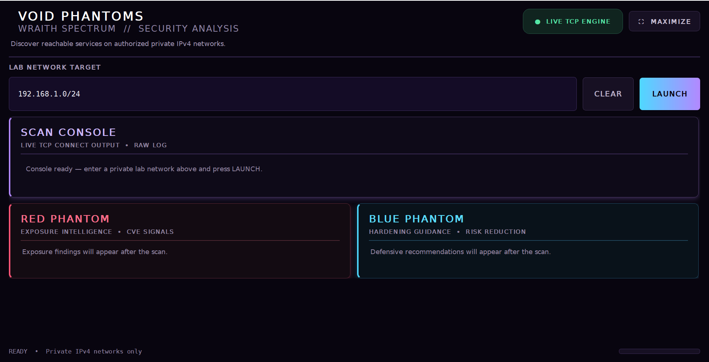
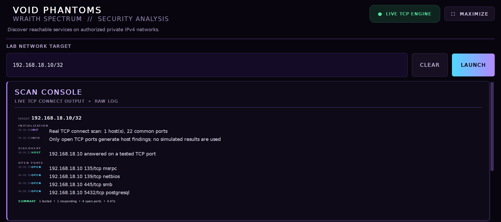
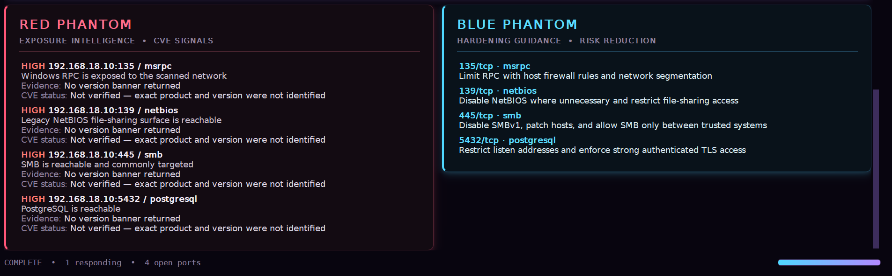

<div align="center">


# VOID PHANTOMS

# Wraith Spectrum

### A modern desktop TCP reconnaissance and exposure analysis suite for authorized private IPv4 networks.


*A desktop cybersecurity utility built to discover reachable services, analyze exposed attack surfaces, and provide immediate defensive guidance for authorized private IPv4 laboratory environments.*

</div>

---

# Overview

**Wraith Spectrum** is a modern desktop reconnaissance utility developed by **Void Phantoms** for educational cybersecurity labs.

Unlike simplistic port scanners, Wraith Spectrum combines:

- High-performance multithreaded TCP scanning
- Live event streaming
- Exposure intelligence
- Defensive hardening recommendations
- Banner collection
- Modern cyberpunk-inspired interface

The application is designed to help students, security enthusiasts, defenders, and penetration testers quickly understand the attack surface of systems located inside authorized private networks.

---

# Screenshots

## Main Interface

<p align="center">

</p>

The application opens with a clean dashboard allowing operators to specify a private IPv4 host or subnet before launching a live reconnaissance session.

---

## Live TCP Scan

<p align="center">

</p>

The scan console streams events in real time while discovering reachable hosts, identifying open TCP services, collecting banners when available, and presenting scan progress.

---

## Exposure Intelligence

<p align="center">

</p>

Once the scan completes, Wraith Spectrum automatically separates offensive findings from defensive recommendations using the **Red Phantom** and **Blue Phantom** intelligence modules.

---

# Features

| Feature | Description |
|----------|-------------|
| ⚡ Real TCP Connect Scanner | Performs genuine TCP connection attempts instead of simulated output |
| 🌐 CIDR Network Support | Scan individual hosts or entire private subnets |
| 🚀 Multi-threaded Engine | Uses ThreadPoolExecutor for concurrent scanning |
| 📡 Live Scan Console | Real-time event streaming with categorized output |
| 🔍 Banner Collection | Collects service banners when available |
| 🔴 Red Phantom | Exposure analysis and risk assessment |
| 🔵 Blue Phantom | Defensive hardening guidance |
| 🎨 Modern Desktop UI | Custom PyQt5 cyberpunk interface |
| 🖥 Cross Platform | Windows, Linux and macOS |
| 🛡 Private Network Enforcement | Restricts scans to RFC1918 private IPv4 ranges |

---

# How It Works

```text
Target Validation
        │
        ▼
Private IPv4 Verification
        │
        ▼
CIDR Expansion
        │
        ▼
Concurrent TCP Connect Scan
(ThreadPoolExecutor)
        │
        ▼
Open Port Detection
        │
        ▼
Banner Collection
        │
        ▼
Exposure Analysis
(Red Phantom)
        │
        ▼
Defensive Guidance
(Blue Phantom)
```

---

# Technology Stack

| Component | Technology |
|------------|------------|
| Language | Python |
| GUI Framework | PyQt5 |
| Networking | socket |
| Concurrency | ThreadPoolExecutor |
| Address Handling | ipaddress |
| Threading | QThread |
| Rich Interface | Qt Widgets |
| Security Logic | Custom Implementation |

---

# Project Structure

```text
Wraith-Spectrum/
│
├── assets/
│   ├── logo.png
│   └── images/
│       ├── Main Starter screen.png
│       ├── port scanning.png
│       └── read teaming and blue teaming - intellegence.png
│
├── wraith_tool.py
├── requirements.txt
└── README.md
```

---

# Installation

## Clone

```bash
git clone <repository-url>
```

```bash
cd Wraith-Spectrum
```

---

## Install Dependencies

```bash
pip install -r requirements.txt
```

or

```bash
pip install PyQt5>=5.15
```

---

## Launch

```bash
python wraith_tool.py
```

---

# Example Targets

Single Host

```text
192.168.18.10/32
```

Entire Subnet

```text
192.168.1.0/24
```

---

# Red Phantom

The **Red Phantom** module evaluates discovered services and highlights potential exposure.

Examples include:

- SMB Exposure
- NetBIOS Reachability
- PostgreSQL Exposure
- Windows RPC
- MySQL
- Redis
- FTP
- HTTP
- HTTPS
- RDP

Each finding includes:

- Severity
- Service
- Evidence
- Version availability
- CVE verification state

---

# Blue Phantom

Blue Phantom immediately provides defensive recommendations for every detected service.

Examples include:

- Disable SMBv1
- Restrict database listeners
- Require TLS
- Limit RPC access
- Disable NetBIOS
- Firewall segmentation
- Network isolation
- Authentication hardening

This makes the project useful for both offensive and defensive security learning.

---

# Why Wraith Spectrum?

Most educational port scanners simply print open ports.

Wraith Spectrum goes further by transforming raw scan results into meaningful security intelligence.

Instead of only answering:

> "Which ports are open?"

it also helps answer:

- Why is this service exposed?
- What is the potential security impact?
- How should defenders reduce the risk?
- What evidence was collected?
- Is version information available?

---

# Supported Platforms

- Windows
- Linux
- macOS

Python Latest Version Recommended

---

# Requirements

- Python (Latest)
- PyQt5 5.15+

---

# Security Notice

> [!IMPORTANT]
> Wraith Spectrum is intended **only for authorized security assessments and educational laboratory environments.**

The application intentionally restricts scans to **private RFC1918 IPv4 networks**, including:

- 10.0.0.0/8
- 172.16.0.0/12
- 192.168.0.0/16

Attempting to scan public Internet addresses is intentionally blocked.

Always obtain proper authorization before performing network reconnaissance.

---

# Educational Purpose

This project demonstrates concepts including:

- Network Reconnaissance
- TCP Connect Scanning
- Multithreaded Programming
- Service Enumeration
- Banner Grabbing
- Exposure Analysis
- Secure GUI Design
- Defensive Security
- Offensive Security
- Python Desktop Development

---

# Contributing

Contributions are welcome.

If you would like to improve the project, feel free to:

- Report issues
- Suggest features
- Improve documentation
- Submit pull requests

---

# About Void Phantoms

**Void Phantoms** is a technology community focused on building educational software, cybersecurity tools, cloud-native applications, artificial intelligence systems, and open-source projects that bridge theory with practical engineering.

---

<div align="center">

## Built with ❤️ by Void Phantoms

*"Exploring systems. Understanding security. Building the future."*

</div>
